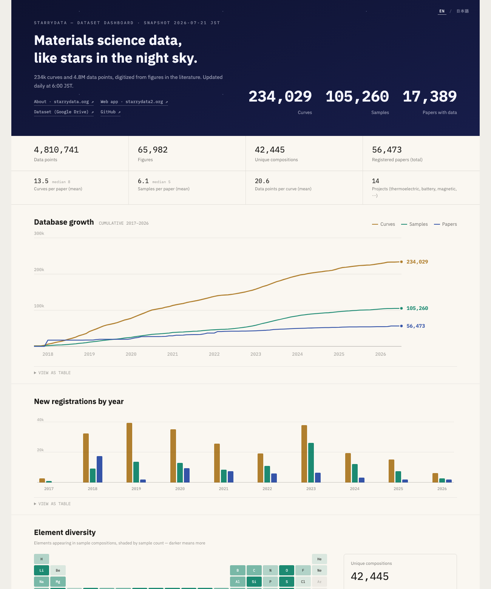

# starrydata-stats

[](https://github.com/kumagallium/starrydata-stats/actions/workflows/update-dashboard.yml)
[](LICENSE)

Aggregation toolkit and auto-updating dashboard for the
[Starrydata](https://starrydata.org/) dataset — an open database of
experimental materials-science data digitized from figures in the literature
by the [Starrydata2](https://www.starrydata2.org/) web app.

**Live dashboard: <https://kumagallium.github.io/starrydata-stats/>**
(English / Japanese, updated daily at 6:00 JST)

[](https://kumagallium.github.io/starrydata-stats/)

*日本語版の README は [README.ja.md](README.ja.md) にあります。*

## What it does

1. **Fetches** the latest dataset (papers / samples / curves CSVs) from the
   official shared [Google Drive folder](https://drive.google.com/drive/folders/1OVMP7j61CJFwLtJ-qZFef9ko40Othayh) — no authentication required.
2. **Aggregates** it from multiple angles: headline counts, per-project /
   per-property / per-journal breakdowns, monthly and yearly registration
   trends, chemical elements appearing in compositions, and completion of the
   `sample_info` metadata (fabrication process, material family, form, …).
3. **Generates** a self-contained, bilingual (EN default / JA) single-file HTML
   dashboard — no server or build step required to view it.
4. **Automates** the whole pipeline with GitHub Actions: every day at 6:00 JST
   it re-aggregates the fresh snapshot, commits the results, and deploys the
   dashboard to GitHub Pages.

## Quick start

With [uv](https://docs.astral.sh/uv/) (dependencies resolve automatically from
inline script metadata):

```bash
uv run aggregate_stats.py --download   # fetch latest data → aggregate → build dashboard
```

Or with pip:

```bash
pip install -r requirements.txt        # pandas, gdown
python aggregate_stats.py --download
```

Then open `dashboard.html` in a browser. Useful variants:

```bash
uv run aggregate_stats.py              # aggregate the local starrydata_dataset/ as-is
uv run download_dataset.py             # download only
uv run generate_dashboard.py           # rebuild dashboard.html from existing output/
```

The dataset itself (~340 MB extracted) is intentionally **not** stored in this
repository; `--download` fetches it on demand.

## Repository layout

| Path | Role |
|---|---|
| `download_dataset.py` | Fetch and safely extract the latest dataset zip from Google Drive |
| `aggregate_stats.py` | All aggregations; writes `output/` and triggers the dashboard build |
| `generate_dashboard.py` | Injects the aggregated data into the HTML template |
| `dashboard_template.html` | Dashboard UI (vanilla JS + SVG, i18n EN/JA, no dependencies) |
| `dashboard.html` | Generated dashboard (committed so Pages can deploy it) |
| `.github/workflows/update-dashboard.yml` | Daily fetch → aggregate → commit → deploy pipeline |
| `output/` | Aggregation results (see below) |

## Outputs

### `output/snapshot_YYYY-MM-DD/` — one directory per dataset snapshot

| File | Contents |
|---|---|
| `summary.json` | Headline counts: registered papers, papers with data, samples, curves, data points, figures, unique DOIs / compositions, per-paper averages |
| `by_project.csv` | Papers, curves, and data points per project (thermoelectric, battery, magnetic, …) |
| `curves_by_property_y.csv` | Curves and data points per property (`prop_y`) |
| `curves_by_property_pair.csv` | Same, per `prop_x` × `prop_y` pair |
| `registrations_by_year.csv` / `registrations_by_month.csv` | New registrations per period, with cumulative columns |
| `papers_by_issued_year.csv` | Papers per publication year |
| `papers_by_journal.csv` / `papers_by_publisher.csv` | Top journals / publishers |
| `top_compositions.csv` | Most frequent sample compositions |
| `elements.csv` | Samples per chemical element found in compositions (feeds the periodic-table heatmap) |
| `sample_info_descriptors.csv` | Completion per `sample_info` descriptor |
| `sample_info_categories.csv` | Category distribution per descriptor (FabricationProcess, Form, …) |

### `output/history.csv` — cross-snapshot time series

One row of headline counts is upserted per snapshot date on every run. Unlike
the dashboard's growth chart — which is *reconstructed* from `created_at`
timestamps and therefore only reflects records that still exist — this file is
a record of what was actually observed on each day, so deletions and cleanups
in the upstream database remain visible. It is not currently rendered on the
dashboard; it exists as an audit trail and future data source.

## Automation

[`update-dashboard.yml`](.github/workflows/update-dashboard.yml) runs daily at
6:00 JST (the upstream snapshot is generated around 2:00 JST):

```
fetch latest zip → aggregate → commit output/ + dashboard.html → deploy to Pages
```

Pushes to `main` redeploy the committed `dashboard.html` without
re-aggregating. Run it manually anytime from the Actions tab ("Run workflow").

## Data source and licensing

- The dataset is created and distributed by the
  [Starrydata project](https://starrydata.org/)
  ([web app](https://www.starrydata2.org/) ·
  [dataset on Google Drive](https://drive.google.com/drive/folders/1OVMP7j61CJFwLtJ-qZFef9ko40Othayh)).
  Rights to the data belong to the Starrydata project; consult them for the
  data's license and citation policy.
- The code in this repository is released under the [MIT License](LICENSE).
